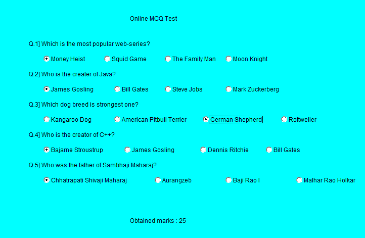

# Online MCQ Test - Java Applet

A GUI-based multiple choice quiz system built with Java Applets and AWT.

### Features
- 5 Questions across Tech, History, and General Knowledge
- Automatic score calculation: 5 marks per correct answer
- Real-time score display
- Built using Java AWT components: Label, CheckboxGroup, Checkbox

### Tech Stack
- **Language**: Java
- **GUI**: Java Applet, AWT
- **Concepts**: Event Handling, ItemListener, Layout Management

### How to Run
1. Compile: `javac MCQ.java`
2. Run with AppletViewer: `appletviewer MCQ.java`
   OR embed in HTML with `<applet code="MCQ.class" width="1000" height="1000"></applet>`

### Screenshots

### Future Improvements
- Load questions from external file
- Add timer functionality
- Store high scores

**Author**: Ary Borkar | B.Tech CSE 2028 | [LinkedIn](https://www.linkedin.com/in/ary-borkar-0678a73a5/)
